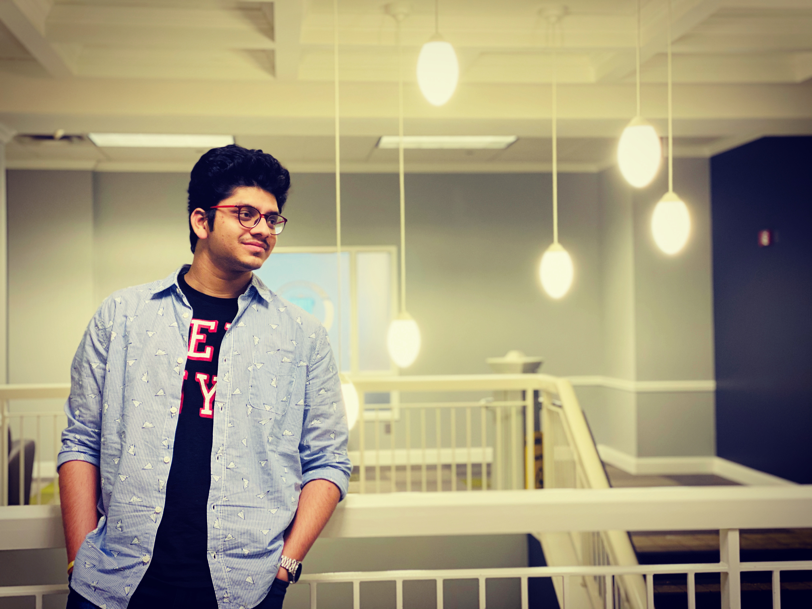

# Prudhvi 

## Current
I am a Graduate student working on my third semester of my masters in Applied Computer Science at Northwest Missouri State University.
## Background
1. I am from Gudur, india and did my bachelors from computer science and engineering. I have completed my schooling from narayana educational institutions in my homwtown. 
1. I dont have any prior industrial experience but I have been a part of some wokshops in my under graduation.

## Plans
I am not sure yet to work in a particular stream. I am looking forward to work on
- UI/UX design
- Android development
## Links
[My Linkedin Profile](https://www.linkedin.com/in/venkat-prudhvi-dommaraju-188720186/)

